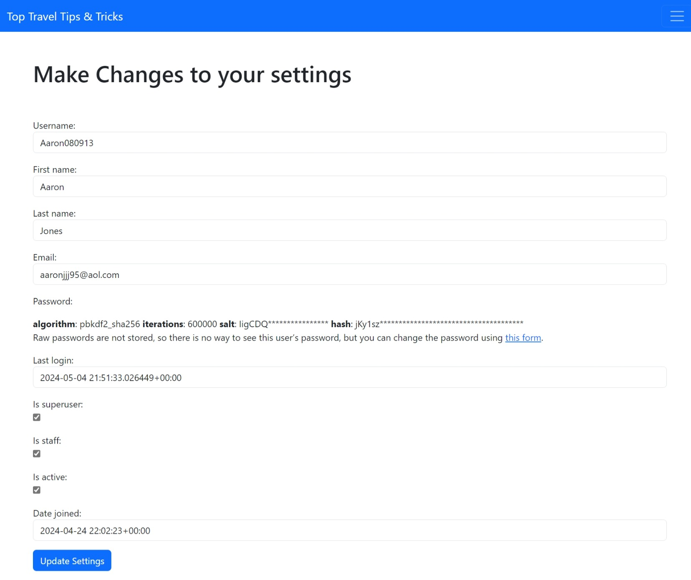

# Travel_Blog - Introduction

Project milestone 4 for Code Institute Full-stack development program.
This project is a Full Stack website built using the Django framework. Travel_Blog is a blog where users can Let people know what their opinion of a certain travel destinations are like. When the user is logged in they can also 
like/unlike a post and comment on a post. They can also share their favourite Holiday destinations by adding a post 
and upload or update their user image and details.

[Live Project Here](https://travel-blog-1-ac4a8d6c6af6.herokuapp.com/)

## User Experience - UX

### User Stories

* As a website user, I can:

1. Navigate around the site and easily view the desired content.
2. View a list of Blog Posts from the categories section and choose accordingly.
3. Click on the posts to read the author details & bio.
4. Register for an account to be able to post.
5. View the number of likes on a post thereby showing which is most popular.
6. View comments on recipes so that I can read other users opinions.

* As logged in website user, I can:

1. Like/unlike A post marking the destinations I would like to visit.
2. Comment on posts and give my opinion .
3. Delete my previous posts.
4. Manage my profile by updating my details and user image.
5. Edit my previously posted blogs.
6. Logout from the website.
7. Add A category to be posted too.

* As a website superuser, I can:

1. Create and publish a new Post.
2. Create a new user, recipes, author and categories.
3. Delete user, recipes, author, categories and comments.
4. Delete user's comments.
5. Edit user's posts.
6. Change the website permissions for a user.

#### Main Site Goals

* To provide users with a good experience when using the travel blog page.
* To provide users with a visually pleasing website that is intuitive to use and easy to navigate, with a fixed navbar.
* To provide a website with a clear purpose.
* To provide role-based permissions that allows user to interact with the website.

## Design

## Features

### Home Page

* The front page image welcomes the user with a short message advertising what the website is about. 

### Home Page - Nav Bar

* In the Nav Bar, when users are not logged in, you will see the ability to log in and to register along with the categories section. 

### Register Page

* The Register Page gives, users the ability to register an account for the travel blog so that they can like & share their own posts, if users have clicked on the incorrect link they can instead go to the log in page. 

### Login Page

* On the Login Page, users that have already registered with the blog can login to access adding new categories and new posts, or if the user has not registerd. Their is a link taking the user to the registration page. 

### Categories Dropdown Menu

* From the dropdown menu, none registered users can access the posts that have already been made by clicking on the category associated to the post. 

### Logged In DropDown Menu

* Once the User is logged in, they will see that the dropdown menu has changed to include details only available to members, and gives the User the ability to Log Out. 

### Add A Category Page

* On The Category Page you have got the ability to create a category so that you can add posts and link them. 

### Posts DropDown

* Lets the User Add A post, or so that they can view all of the posts in a list view. 

### Add Blog Post Page

* Lets the User Add A Blog Post, and can function the post.

### Update Blog Post Page

* On this page, users are allowed to edit their own posts. The website superuser can update any post on the blog with having to access the admin panel.

### Delete Blog Post Page

* On this page, users are allowed to Delete their own posts. The website superuser can 
  delete any post on the blog with having to access the admin panel.

### Blog Post Page

* On this page, users are allowed to access posts. The User can see any images attatched to the post aswell as any likes and comments.

### Profiles DropDown

* On this DropDown, it gives the user the option to change different aspects of their own profil aswell as a profile view.

### Profiles Settings Edit

* This lets you change the log in settings for Profiles.

### Profiles Settings Edit

* This lets you change the Profile, so that A Bio or a picture can be added, these are also present at the bottom of the blog posts.

### Profiles View

* This lets you View your Profile.

### Testing

## Credits

### Content

* Nav Bar And Styling of forms can be found from Bootsrap [Bootstrap]('https://getbootstrap.com/')
* The Picture used in the Hong Kong Page was sourced from [Hong Kong]('https://www.bing.com/images/search?view=detailV2&ccid=%2bBeTKEtd&id=662F9F90BCC23E4B6036931A144465EFC7C0BEB1&thid=OIP.-BeTKEtdXxdu6OePNqE6ngHaDK&mediaurl=https%3a%2f%2fth.bing.com%2fth%2fid%2fR.f81793284b5d5f176ee8e78f36a13a9e%3frik%3dsb7Ax%252b9lRBQakw%26riu%3dhttp%253a%252f%252fupload.wikimedia.org%252fwikipedia%252fcommons%252f1%252f18%252fHong_Kong_Night_Skyline.jpg%26ehk%3dYeHA8V9x%252bFivbEEkcYT0ddsRduo86nODrI0062%252bSE5c%253d%26risl%3d1%26pid%3dImgRaw%26r%3d0&exph=2000&expw=4670&q=hongkong&simid=608027645965578457&FORM=IRPRST&ck=C25E3628A1DECDB2E8281EA484BC182A&selectedIndex=1&itb=0')
* The images were taken for New York are sourced from [New York]('https://www.bing.com/images/search?view=detailV2&ccid=v3VfcNBy&id=2B479EF50976140ECF4D34DBC54E402E8C5C009E&thid=OIP.v3VfcNByfpqv4OTwpHqMDQHaM9&mediaurl=https%3a%2f%2fmostbeautifulpicture.com%2fwp-content%2fuploads%2f2016%2f09%2fEmpire-State-Building-New-York-1-585x1024.jpeg&cdnurl=https%3a%2f%2fth.bing.com%2fth%2fid%2fR.bf755f70d0727e9aafe0e4f0a47a8c0d%3frik%3dngBcjC5ATsXbNA%26pid%3dImgRaw%26r%3d0&exph=1024&expw=585&q=new+york&simid=607998659265510619&FORM=IRPRST&ck=FDB8F03018A42A58A0F3967403B44570&selectedIndex=3&itb=0g')
* The Image Used In The Kenya Post was sourced from [Kenya]('https://www.tripadvisor.co.uk/Attraction_Review-g294207-d25401985-Reviews-Tishmac_Safaris-Nairobi.html')
* The Image Used for the Almeria Post was sourced from [Almeria]('http://www.weeky.es/la-catedral-de-almeria-fortaleza/')
* The Image Used for Krabi Post was sourced from [Krabi]('https://blog.easyregistry.com.au/6-amazing-yet-affordable-honeymoon-destinations-for-australian-couples/')
* The Background Image from the home screen was sourced from [home_screen]('https://www.bing.com/images/search?view=detailV2&ccid=VEvTuMNY&id=7DC98F8E91A2DCBCB4D204D3B86A3598DD3B4A06&thid=OIP.VEvTuMNY6VnbjC9hXgmoVwHaEK&mediaurl=https%3a%2f%2fstylecaster.com%2fwp-content%2fuploads%2f2016%2f09%2ftravel.jpg%3fresize%3d282&cdnurl=https%3a%2f%2fth.bing.com%2fth%2fid%2fR.544bd3b8c358e959db8c2f615e09a857%3frik%3dBko73Zg1arjTBA%26pid%3dImgRaw%26r%3d0&exph=540&expw=960&q=travel&simid=608034105602871781&FORM=IRPRST&ck=C8BCF698BA178A27607ADC52FBAEED74&selectedIndex=9&itb=0')

### Information Sources / Resources

* [code.my](https://codemy.com/) followed a guide on creating a blog as a base template.
* [Stack Overflow](https://stackoverflow.com/) used some ideas from this website to help to finalise my blog.

